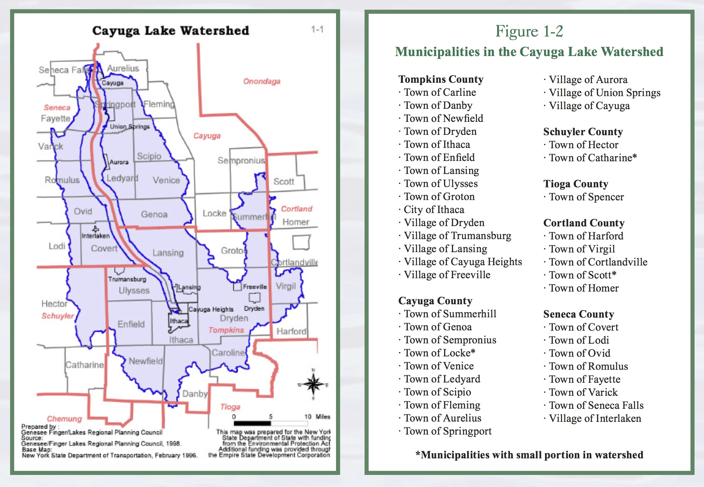

 

  

IO meetings currently take place every 4th Wednesday of the month
   at 7pm in the Ithaca Town Hall, 215 N. Tioga St.
   
   **If your municipality would like to host a meeting, please contact XXX.**

  

  

   <input type="button" class="btn btn-info" value="Meeting Minutes" onclick="location.href = 'minutes.html';">
  

IO Membership

<h5>The Intermunicipal Organization consists of appointed representatives from municipalities within the Cayuga Lake watershed.
 
 The below map, taken from the <a href="rpp.html">2001 Restoration and Protection Plan</a>, shows municipalities within the watershed. 
 
For more information about joining the IO, please email XXX.</h5>

