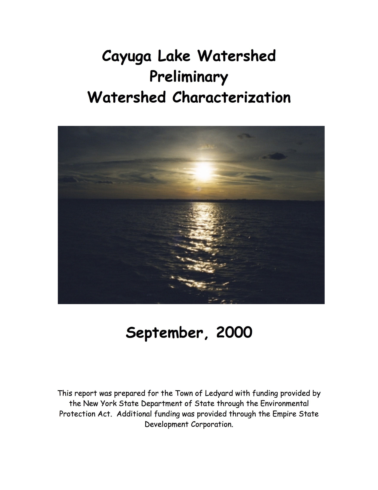
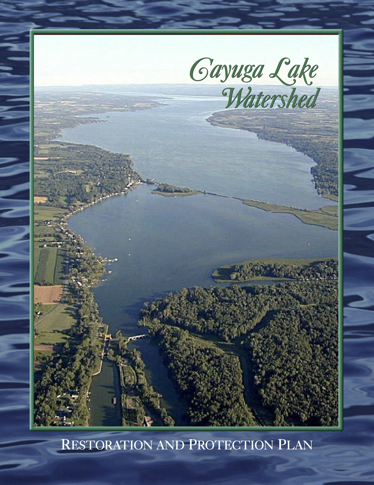
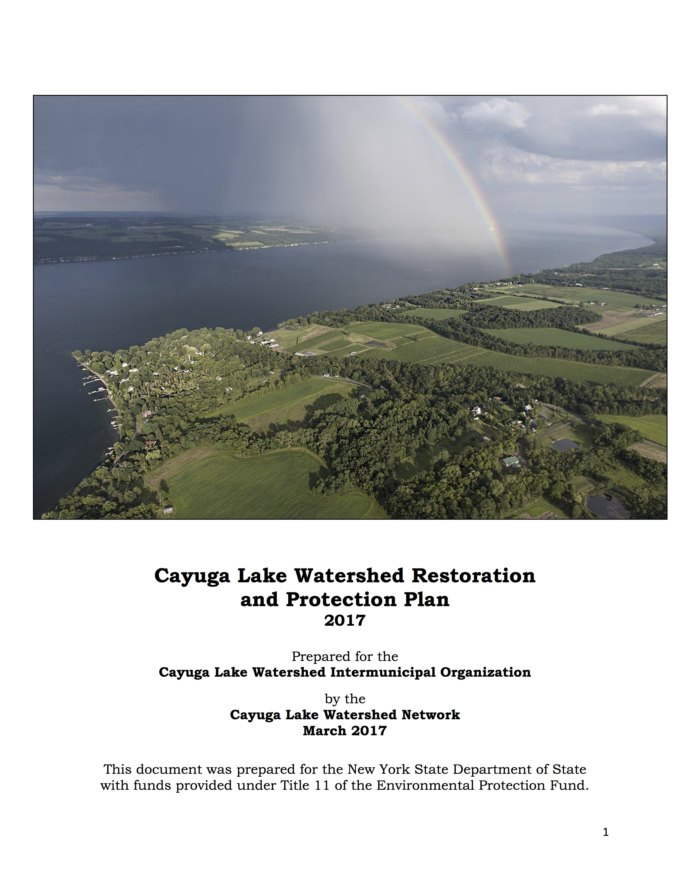

 

<h3><a href="documents/CLW_characterization_2000.pdf">Cayuga Lake Watershed Characterization</a></h3>

<h3><a href="documents/CLW_RPP_2001.pdf">2001 Restoration and Protection Plan</a></h3>

<h3><a href="documents/clwrpp_2017.pdf">2017 Restoration and Protection Plan</a></h3>

